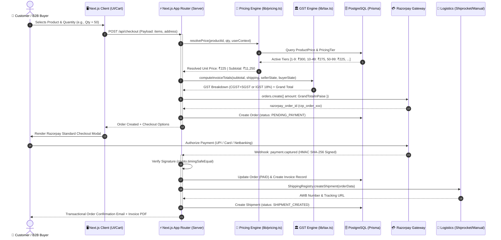

# DigitalWorld — System Architecture & Data Flow

DigitalWorld is built on a decoupled, high-performance architecture powered by Next.js 14 App Router, TypeScript, Prisma ORM, and resilient cloud integration brokers.

---

## 1. 3D Layered Isometric Architecture

```text
                                  ==================================================
                                  ▼  TIER 1: CLIENT INTERFACE & PRESENTATION LAYER  ▲
                                  ==================================================
                                    /                                             /│
                                   /  ┌───────────────┐   ┌─────────────────┐    / │
                                  /   │  B2C Visitor  │   │  B2B Wholesale  │   /  │
                                 /    │  Storefront   │   │  Portal (KYC)   │  /   │
                                /     └───────┬───────┘   └────────┬────────┘ /    │
                               /              │  ┌───────────────┐ │         /     │
                              /               └─▶│  Admin Panel  │◀┘        /      │
                             /                   │  & Logistics  │         /       │
                            /                    └───────┬───────┘        /        │
                           /─────────────────────────────┼───────────────/         │
                           │                             │               │         │
                           │                             ▼ (HTTPS/WSS)   │         │
                           │      ==================================================
                           │      ▼  TIER 2: EDGE ROUTING & APPLICATION RUNTIME    ▲
                           │      ==================================================
                           │        /                                             /│
                           │       /  ┌─────────────────────────────────────┐    / │
                           │      /   │      Next.js 14 App Router Core     │   /  │
                           │     /    │  ┌──────────────┐ ┌───────────────┐ │  /   │
                           │    /     │  │ Server Action│ │ API Handlers  │ │ /    │
                           │   /      │  │ & SSR Pages  │ │ (/api/v1/*)   │ │/     │
                           │  /       │  └───────┬──────┘ └───────┬───────┘ │      │
                           │ /        └──────────┼────────────────┼─────────┘      │
                           │/────────────────────┼────────────────┼────────────────│
                           │                     │                │                │
                           │                     ▼                ▼                │
                           │      ==================================================
                           │      ▼  TIER 3: CORE ALGORITHM & DOMAIN SERVICE MESH  ▲
                           │      ==================================================
                           │        /                                             /│
                           │       /  ┌──────────────┐   ┌──────────────────┐    / │
                           │      /   │ resolvePrice │   │computeInvoiceTot.│   /  │
                           │     /    │ Engine       │   │  GST Matrix      │  /   │
                           │    /     └───────┬──────┘   └────────┬─────────┘ /    │
                           │   /              │  ┌──────────────┐ │          /     │
                           │  /               └─▶│ShippingRegist│◀┘         /      │
                           │ /                   │Courier Layer │          /       │
                           │/                    └───────┬──────┘         /        │
                           │─────────────────────────────┼───────────────/         │
                           │                             │                         │
                           │                             ▼ (Prisma / API SDKs)     │
                           │      ==================================================
                           │      ▼  TIER 4: PERSISTENCE & MULTI-CLOUD INTEGRATIONS▲
                           │      ==================================================
                           │        /                                             /
                           │       /  ┌──────────────┐   ┌──────────────────┐    /
                           │      /   │  PostgreSQL  │   │     Razorpay     │   /
                           │     /    │  Database    │   │  Payment Gateway │  /
                           │    /     └───────┬──────┘   └────────┬─────────┘ /
                           │   /              │  ┌──────────────┐ │          /
                           │  /               └─▶│  Shiprocket  │◀┘         /
                           │ /                   │Live Logistics│          /
                           │/                    └──────────────┘         /
                           ================================================
```

---

## 2. End-to-End Reactive Data Flow



---

## 3. Core Architectural Principles

1. **Server-Side Authority:** The client browser never dictates prices, tax breakdowns, or grand totals. Every checkout and quotation is verified on the server against active database rules.
2. **Decoupled Monolith:** Business logic is organized in pure TypeScript modules (`lib/pricing.ts`, `lib/tax.ts`, `lib/shipping/`) with zero coupling to React rendering layers.
3. **Pluggable Logistics:** The shipping abstraction layer allows seamless addition of new courier APIs without changing checkout or tracking controllers.
