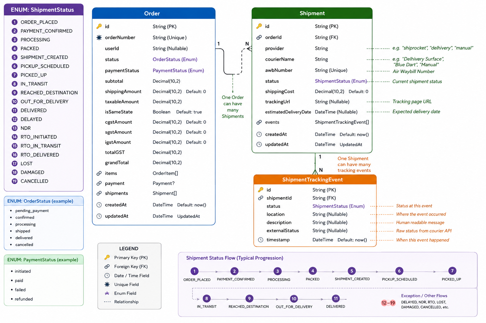
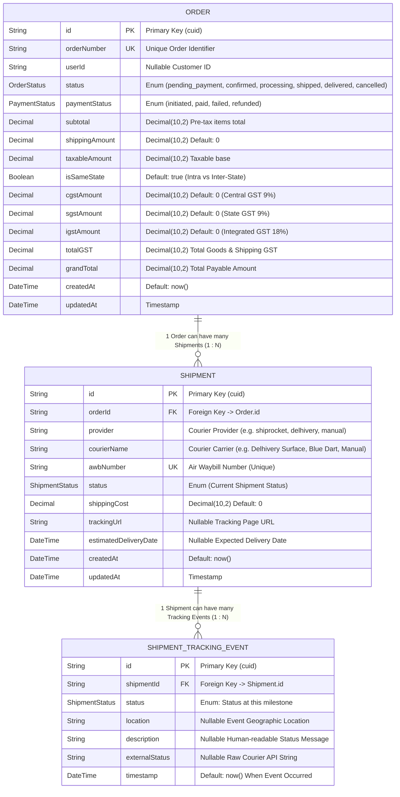

# DigitalWorld — Database Architecture & Data Models

DigitalWorld uses **PostgreSQL** paired with **Prisma ORM** as its primary relational database.

---

## 1. Visual Database Entity Relationship Diagram

<p align="center">
  
</p>

---

## 2. Interactive Schema Entity Relationship Model (Mermaid ERD)



---

## 3. Schema Legend & Field Attributes

| Symbol / Icon | Attribute Type | Description |
|---|---|---|
| 🔑 `PK` | **Primary Key** | Unique system identifier for the record (`cuid`) |
| 🔗 `FK` | **Foreign Key** | Relational link to parent model (`onDelete: Cascade` where applicable) |
| 🌟 `UK` | **Unique Field** | Value must be unique across the entire database (`orderNumber`, `awbNumber`) |
| 🏷️ `Enum` | **Enum Type** | Standardized enumerated state machine value |
| 🕒 `DateTime` | **Timestamp Field** | Automated `createdAt` and `updatedAt` tracking |

---

## 4. Prisma Schema Definition

```prisma
enum ShipmentStatus {
  ORDER_PLACED
  PAYMENT_CONFIRMED
  PROCESSING
  PACKED
  SHIPMENT_CREATED
  PICKUP_SCHEDULED
  PICKED_UP
  IN_TRANSIT
  REACHED_DESTINATION
  OUT_FOR_DELIVERY
  DELIVERED
  DELAYED
  NDR
  RTO_INITIATED
  RTO_IN_TRANSIT
  RTO_DELIVERED
  LOST
  DAMAGED
  CANCELLED
}

enum OrderStatus {
  pending_payment
  confirmed
  processing
  shipped
  delivered
  cancelled
}

enum PaymentStatus {
  initiated
  paid
  failed
  refunded
}

model Order {
  id              String         @id @default(cuid())
  orderNumber     String         @unique
  userId          String?
  status          OrderStatus    @default(pending_payment)
  paymentStatus   PaymentStatus  @default(initiated)
  subtotal        Decimal        @db.Decimal(10, 2)
  shippingAmount  Decimal        @default(0) @db.Decimal(10, 2)
  taxableAmount   Decimal        @db.Decimal(10, 2)
  isSameState     Boolean        @default(true)
  cgstAmount      Decimal        @default(0) @db.Decimal(10, 2)
  sgstAmount      Decimal        @default(0) @db.Decimal(10, 2)
  igstAmount      Decimal        @default(0) @db.Decimal(10, 2)
  totalGST        Decimal        @db.Decimal(10, 2)
  grandTotal      Decimal        @db.Decimal(10, 2)
  items           OrderItem[]
  payment         Payment?
  shipments       Shipment[]
  createdAt       DateTime       @default(now())
  updatedAt       DateTime       @updatedAt
}

model Shipment {
  id                    String                  @id @default(cuid())
  orderId               String
  order                 Order                   @relation(fields: [orderId], references: [id])
  provider              String                  // "shiprocket", "delhivery", "manual"
  courierName           String                  // "Delhivery Surface", "Blue Dart", "Manual"
  awbNumber             String                  @unique
  status                ShipmentStatus          @default(SHIPMENT_CREATED)
  shippingCost          Decimal                 @default(0) @db.Decimal(10, 2)
  trackingUrl           String?
  estimatedDeliveryDate DateTime?
  events                ShipmentTrackingEvent[]
  createdAt             DateTime                @default(now())
  updatedAt             DateTime                @updatedAt
}

model ShipmentTrackingEvent {
  id             String         @id @default(cuid())
  shipmentId     String
  shipment       Shipment       @relation(fields: [shipmentId], references: [id], onDelete: Cascade)
  status         ShipmentStatus
  location       String?
  description    String?
  externalStatus String?
  timestamp      DateTime       @default(now())
}
```
