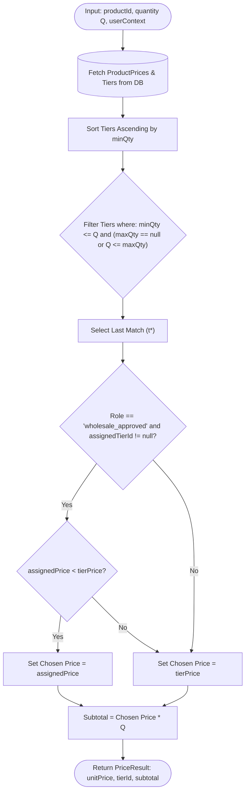

# DigitalWorld — Pricing & GST Tax Engine

DigitalWorld uses a single source of truth server-side engine for quantity tiers, wholesale overrides, and Indian GST tax calculations.

---

## 1. Dual-Persona Server-Side Dynamic Price Resolution (`resolvePrice`)
**Location:** `lib/pricing.ts`

### Logic
For customer order quantity $Q$ and buyer context $C = \langle \text{role}, \text{assignedTierId} \rangle$:

1. **Active Quantity Tier Selection ($t^*$):**
   ```text
   t* = Largest tier in T such that (t.minQty <= Q) AND (t.maxQty == null OR Q <= t.maxQty)
   ```

2. **Wholesale Override Evaluation ($P_{\text{eff}}$):**
   ```text
   IF role == "wholesale_approved" AND assignedTierId != null:
       P_eff = MIN(t*.pricePerUnit, assignedTierPrice.pricePerUnit)
   ELSE:
       P_eff = t*.pricePerUnit
   ```

3. **Subtotal Formulation:**
   ```text
   Subtotal = P_eff * Q
   ```



---

## 2. Dynamic Quantity Tier Matching Algorithm (`getPriceForQuantity`)

```typescript
export function getPriceForQuantity(
  tiers: TierLike[],
  quantity: number
): TierLike | null {
  if (!tiers || tiers.length === 0) return null;
  const sorted = [...tiers].sort((a, b) => a.minQty - b.minQty);

  const match = sorted
    .filter(
      (t) => quantity >= t.minQty && (t.maxQty === null || quantity <= t.maxQty)
    )
    .pop();

  return match || null;
}
```

---

## 3. Tier Unlock Nudge & Upsell Incentive Engine (`getNextTierHint`)

```text
ΔQ = nextTier.minQty - currentQuantity

Nudge Trigger Condition:
- IF (1 <= ΔQ <= 3): Display "Add ΔQ more pieces to unlock lower price!"
- ELSE: Suppress hint (prevent notification fatigue)

Projected Savings:
Savings = (currentQuantity * currentUnitPrice) - ((currentQuantity + ΔQ) * nextTierUnitPrice)
```

---

## 4. Unified Indian GST Tax Calculation Engine (`computeInvoiceTotals`)
**Location:** `lib/tax.ts`

### State Normalization & Tax Partition Logic
```text
isSameState = (trim(lowercase(sellerState)) === trim(lowercase(buyerState)))

Tax Breakdown Formulation:
- Goods GST Rate (r) = 18% (0.18)
- Shipping GST Rate (rs) = 18% (0.18)

IF isSameState === true (Intra-State Transaction):
    CGST = roundToTwo(Subtotal * 0.09)
    SGST = roundToTwo(Subtotal * 0.09)
    IGST = 0.00
ELSE (Inter-State Transaction):
    CGST = 0.00
    SGST = 0.00
    IGST = roundToTwo(Subtotal * 0.18)

Shipping GST = roundToTwo(ShippingCost * 0.18)
Grand Total  = roundToTwo(Subtotal + TotalGoodsGST + ShippingCost + ShippingGST)
```
