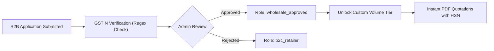

# DigitalWorld — Platform Security & Best Practices

DigitalWorld employs enterprise security standards across authentication, checkout integrity, and API infrastructure.

---

## 1. Core Security Features

- **Server-Authoritative Pricing:** Client requests never dictate prices or tax amounts. All calculations are executed server-side via `lib/pricing.ts` and `lib/tax.ts`.
- **Timing-Safe HMAC Verification:** Razorpay signatures are verified using `crypto.timingSafeEqual` to eliminate timing side-channel vulnerabilities.
- **Role-Based Access Control (RBAC):** Next.js middleware and route handlers restrict admin endpoints (`/admin/*`) and wholesale portal actions (`/api/admin/*`) using verified JWT session roles.
- **Webhook Idempotency:** Payment and courier status webhooks use atomic database checks to prevent replay attacks or double fulfillment.
- **Environment Isolation:** Zero hardcoded credentials; all API keys, secrets, and database credentials are read from `.env` at runtime.

---

## 2. B2B Verification & KYC Workflow

