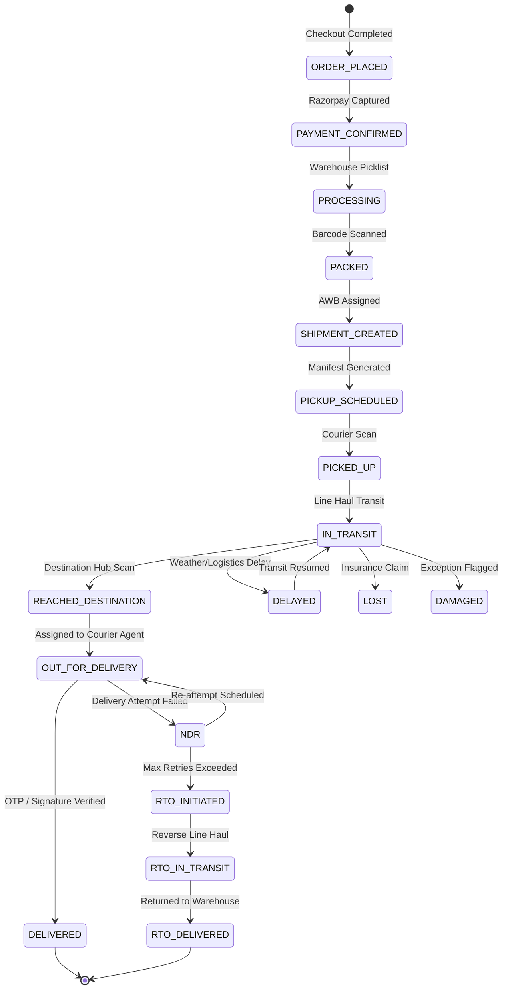

# DigitalWorld — Multi-Carrier Logistics & Shipping Engine

DigitalWorld features an extensible shipping layer supporting **Shiprocket**, **Delhivery Direct**, and **Manual/Offline Courier Dispatch**.

---

## 1. Multi-Carrier Brokerage & Provider Architecture

**Location:** `lib/shipping/`

```typescript
export class ShippingRegistry {
  private static providers: Map<string, ShippingProvider> = new Map();

  public static register(name: string, provider: ShippingProvider) {
    this.providers.set(name.toLowerCase(), provider);
  }

  public static async getBestRates(
    pickupPincode: string,
    deliveryPincode: string,
    weightGrams: number,
    cod: boolean
  ): Promise<CourierOption[]> {
    const activeProviders = Array.from(this.providers.values());
    const ratePromises = activeProviders.map((p) =>
      p.getRates(pickupPincode, deliveryPincode, weightGrams, cod).catch(() => [])
    );
    const results = await Promise.all(ratePromises);
    return results.flat().sort((a, b) => a.rate - b.rate || a.etdDays - b.etdDays);
  }
}
```

---

## 2. Volumetric Weight Calculation

For carton dimensions $L \times W \times H$ in centimeters and actual weight $W_{\text{actual}}$ in kilograms:

```text
Volumetric Weight (kg) = (Length * Width * Height) / 5000
Chargeable Weight (kg) = MAX(Actual Weight, Volumetric Weight)
```

---

## 3. 19-State Shipment Status Normalization State Machine


